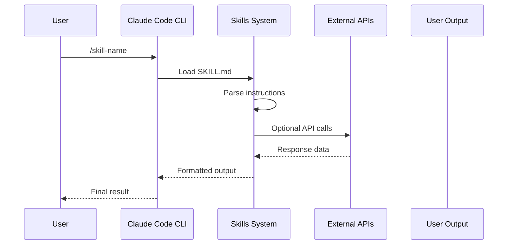

# Skills System Architecture

> **Status**: Complete | **Version**: 1.0.0 | **Last Updated**: 2026-05-12

## Overview

The Skills System is a modular AI instruction framework enabling specialized workflows across content creation, LinkedIn automation, developer tooling, and graphics generation. Each skill contains self-contained instructions, references, and examples for specific tasks.

---

## System Architecture

```mermaid
graph TB
    subgraph "Skills Root"
        CLI[Claude Code CLI<br/>User Interface]
    end
    
    subgraph "skills/"
        AP[apify/]
        CO[content/]
        DE[developer/]
        GR[graphics/]
        LI[linkedin/]
        ST[streamlit/]
        VI[visual-explainer/]
    end
    
    CLI --> AP
    CLI --> CO
    CLI --> DE
    CLI --> GR
    CLI --> LI
    CLI --> ST
    CLI --> VI
    
    subgraph "58 Skills Total"
        AP1[apify-actor-development]
        AP2[apify-content-analysis]
        AP3[apify-lead-generation]
        AP4[apify-market-research]
        AP5[apify-trend-analysis]
        
        CO1[content-matrix]
        CO2[gemini-carousel]
        CO3[gemini-infographic]
        CO4[graphic-designer]
        CO5[hook-generator]
        CO6[humanizer]
        CO7[newsletter-voice]
        CO8[post-formatter]
        CO9[post-scorer]
        CO10[post-writer]
        CO11[quote-post]
        CO12[reels-scripting]
        CO13[voice-builder]
        CO14[youtube-thumbnail]
        
        DE1[ai-wrapper-product]
        DE2[creating-pr]
        DE3[design-doc-mermaid]
        DE4[excalidraw-diagram-generator]
        DE5[graphify-out]
        DE6[issue-workflow]
        DE7[pr-comment]
        DE8[project-idea-validator]
        DE9[readme-generator]
        DE10[skills-mcp-builder]
        DE11[skills-md-to-pdf-converter]
        DE12[use-tinyfish]
        DE13[web-design-reviewer]
        
        GR1[website-to-hyperframes]
        
        LI1[analytics-dashboard]
        LI2[linkedin-comment-generator]
        LI3[linkedin-profile-optimizer]
        LI4[linkedin-sequence]
        LI5[niche-research]
        LI6[pinned-comment]
        LI7[profile-optimizer]
        LI8[writing-linkedin-posts]
        
        ST1[addressing-pr-review-comments]
        ST2[AGENTS.md]
        ST3[assessing-external-test-risk]
        ST4[checking-changes]
        ST5[CLAUDE.md]
        ST6[creating-pull-requests]
        ST7[debugging-streamlit]
        ST8[discovering-make-commands]
        ST9[finalizing-pr]
        ST10[fixing-flaky-e2e-tests]
        ST11[fixing-streamlit-ci]
        ST12[generating-changelog]
        ST13[implementing-feature]
        ST14[improving-frontend-coverage]
        ST15[improving-python-coverage]
        ST16[sharing-pr-agent-artifacts]
        ST17[understanding-streamlit-architecture]
        ST18[updating-internal-docs]
        ST19[writing-spec]
        
        VI1[commands]
        VI2[references]
        VI3[scripts]
        VI4[SKILL.md]
        VI5[templates]
    end
    
    AP --> AP1 & AP2 & AP3 & AP4 & AP5
    CO --> CO1 & CO2 & CO3 & CO4 & CO5 & CO6 & CO7 & CO8 & CO9 & CO10 & CO11 & CO12 & CO13 & CO14
    DE --> DE1 & DE2 & DE3 & DE4 & DE5 & DE6 & DE7 & DE8 & DE9 & DE10 & DE11 & DE12 & DE13
    GR --> GR1
    LI --> LI1 & LI2 & LI3 & LI4 & LI5 & LI6 & LI7 & LI8
    ST --> ST1 & ST2 & ST3 & ST4 & ST5 & ST6 & ST7 & ST8 & ST9 & ST10 & ST11 & ST12 & ST13 & ST14 & ST15 & ST16 & ST17 & ST18 & ST19
    VI --> VI1 & VI2 & VI3 & VI4 & VI5
```



---

## Skill Categories

### Content Creation (14 skills)

| Skill | Purpose | External Dependencies |
|-------|---------|----------------------|
| `content-matrix` | 32 post ideas from content pillars | Gemini API |
| `gemini-carousel` | LinkedIn carousels (1080×1350) | Gemini API |
| `gemini-infographic` | Whiteboard-style images | Gemini API |
| `graphic-designer` | HTML/CSS or AI-generated visuals | Gemini API |
| `hook-generator` | 6 viral hook variations | None |
| `humanizer` | Remove AI writing detection | None |
| `newsletter-voice` | Newsletter voice profiling | None |
| `post-formatter` | PAS/AIDA/STAR/SLAY frameworks | None |
| `post-scorer` | Performance scoring | None |
| `post-writer` | Write in authentic voice | voice.md |
| `quote-post` | Quote graphics + prompts | Gemini API |
| `reels-scripting` | Reel scripts from content | Gemini API |
| `voice-builder` | Build voice profile | Samples |
| `youtube-thumbnail` | CTR-optimized thumbnails | Gemini API |

### LinkedIn Automation (8 skills)

| Skill | Purpose | External Dependencies |
|-------|---------|----------------------|
| `analytics-dashboard` | Performance dashboard | LinkedIn API |
| `linkedin-comment-generator` | 14 comment variants | Gemini API |
| `linkedin-profile-optimizer` | Profile optimization | Gemini API |
| `linkedin-sequence` | 2-message DM sequence | Gemini API |
| `niche-research` | 20 trending stories (7 days) | Claude Chrome, Reddit, X |
| `pinned-comment` | Signature comments | Gemini API |
| `profile-optimizer` | Full profile rebuild | Gemini API |
| `writing-linkedin-posts` | Post creation | Gemini API |

### Developer Tools (13 skills)

| Skill | Purpose | External Dependencies |
|-------|---------|----------------------|
| `ai-wrapper-product` | AI wrapper development | None |
| `creating-pr` | PR creation workflow | GitHub CLI |
| `design-doc-mermaid` | Mermaid diagrams | Mermaid, Markdown |
| `excalidraw-diagram-generator` | Excalidraw diagrams | Excalidraw |
| `graphify-out` | Knowledge graph input | None |
| `issue-workflow` | GitHub Issues management | GitHub CLI |
| `pr-comment` | PR commenting | GitHub CLI |
| `project-idea-validator` | Live data validation | Web search |
| `readme-generator` | README creation | None |
| `skills-mcp-builder` | MCP server development | MCP SDK |
| `skills-md-to-pdf-converter` | Markdown → PDF | Markdown parser |
| `use-tinyfish` | Web scraping/automation | Tinyfish |
| `web-design-reviewer` | UI/UX audit | None |

### Apify Automation (5 skills)

| Skill | Purpose | External Dependencies |
|-------|---------|----------------------|
| `apify-actor-development` | Actor development | Apify SDK |
| `apify-content-analysis` | Content analysis | Apify actors |
| `apify-lead-generation` | Lead generation | Apify actors |
| `apify-market-research` | Market research | Apify actors |
| `apify-trend-analysis` | Trend analysis | Apify actors |

### Graphics & Video (1 skill)

| Skill | Purpose | External Dependencies |
|-------|---------|----------------------|
| `website-to-hyperframes` | Website → videos | HyperFrames |

### Streamlit (19 items)

| Skill | Purpose |
|-------|---------|
| `addressing-pr-review-comments` | PR feedback workflow |
| `assessing-external-test-risk` | Test risk assessment |
| `checking-changes` | Change verification |
| `debugging-streamlit` | Debug workflows |
| `discovering-make-commands` | Make command discovery |
| `finalizing-pr` | PR finalization |
| `fixing-flaky-e2e-tests` | E2E test fixes |
| `fixing-streamlit-ci` | CI troubleshooting |
| `generating-changelog` | Changelog creation |
| `implementing-feature` | Feature implementation |
| `improving-frontend-coverage` | Frontend test coverage |
| `improving-python-coverage` | Python test coverage |
| `sharing-pr-agent-artifacts` | PR artifact sharing |
| `understanding-streamlit-architecture` | Architecture docs |
| `updating-internal-docs` | Docs updates |
| `writing-spec` | Specification writing |

### Visual Explainer (5 components)

| Component | Purpose |
|-----------|---------|
| `commands/` | CLI commands |
| `references/` | Reference documentation |
| `scripts/` | Automation scripts |
| `templates/` | Output templates |
| `SKILL.md` | Core skill instructions |

---

## Skill File Structure

```
skills/[category]/
├── skill-name/
│   ├── SKILL.md              # Core instructions & workflows
│   ├── references/           # Examples, hooks, templates
│   ├── assets/               # Static assets
│   └── EXAMPLES.md           # Usage examples
```

### SKILL.md Structure

```markdown
# Skill Name

> One-line description

## Overview
## Usage
## Workflow Steps
## Examples
## Configuration
## Related Skills
```

---

## Data Flow



---

## Invocation Methods

### Slash Commands
```
/skill-name
/content-matrix
/git-release
```

### Natural Language
```
"Generate tests for src/utils.js"
"Create architecture diagram for auth system"
"Write a LinkedIn post about AI trends"
```

### Claude Code Skill Tool
```
Use the Skill tool with skill="skill-name"
```

---

## External Integrations

| Service | Skills Using It |
|---------|-----------------|
| Gemini API | content/, linkedin/ (most) |
| GitHub CLI | creating-pr, issue-workflow, pr-comment |
| Apify | apify/* (all 5) |
| Claude Chrome | niche-research |
| Tinyfish | use-tinyfish |
| MCP SDK | skills-mcp-builder |

---

## Quality Attributes

| Attribute | Measurement |
|-----------|-------------|
| Coverage | 58 skills across 7 categories |
| Modularity | Each skill self-contained |
| Discoverability | Auto-listed in README |
| Extensibility | Standard SKILL.md format |
| Portability | Git-native, no build step |

---

## Architectural Decisions

### ADR-001: Skill Directory Structure

**Decision**: Flat category directories with nested skill folders.

**Rationale**: 
- Easy navigation by category
- Each skill has isolated namespace
- No deep nesting (max 2 levels)

**Alternatives Considered**:
- Single flat directory → namespace collisions
- 3+ level nesting → unnecessary complexity

### ADR-002: SKILL.md as Primary Interface

**Decision**: SKILL.md is the universal skill interface.

**Rationale**:
- Claude Code natively reads .md files
- Human-readable format
- Version control friendly

### ADR-003: External API Abstraction

**Decision**: Skills call external APIs directly when needed.

**Rationale**:
- Simplicity over abstraction
- Skills are user-specific anyway
- No API key management needed at system level

---

## Related Documentation

| Document | Location |
|----------|----------|
| README | README.md (lines 30-102) |
| Coding Standards | .claude/rules/coding_standards.md |
| Naming Conventions | .claude/rules/naming_conventions.md |
| Memory System | .claude/memory/MEMORY.md |

---

*Last generated: 2026-05-12*